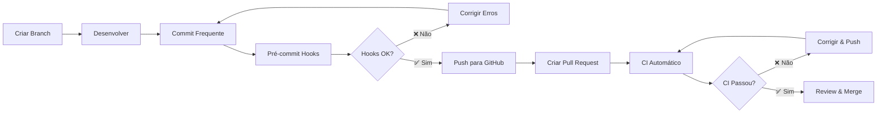

# 🚀 Guia de Desenvolvimento - Sistema PEI

## 📋 Índice

1. [Configuração Inicial](#-configuração-inicial)
2. [Fluxo de Desenvolvimento](#-fluxo-de-desenvolvimento)
3. [Pré-commit Hooks](#-pré-commit-hooks)
4. [Comandos Principais](#-comandos-principais)
5. [Verificações do CI](#-verificações-do-ci)
6. [Boas Práticas](#-boas-práticas)
7. [Troubleshooting](#-troubleshooting)

## 🛠️ Configuração Inicial

### 1. **Clone e Configuração do Projeto**

```bash
# Clone do repositório
git clone git@github.com:ifrn-pei/sistema_pei.git
cd sistema_pei

# Configurar usuário Git (se necessário)
git config user.name "Seu Nome"
git config user.email "seu.email@ifrn.edu.br"

# Criar branch de desenvolvimento
git checkout -b feature/sua-funcionalidade
```

### 2. **Configuração do Ambiente Python**

```bash
# Instalar dependências (escolha uma opção)

# Opção A: Poetry (recomendado)
poetry install
poetry shell

# Opção B: pip + venv
python -m venv venv
source venv/bin/activate  # Linux/Mac
# ou
venv\Scripts\activate     # Windows
pip install -r requirements/local.txt
```

### 3. **Instalação do Pré-commit**

```bash
# Instalar pré-commit hooks
pre-commit install

# Executar em todos os arquivos (primeira vez)
pre-commit run --all-files
```

## 🔄 Fluxo de Desenvolvimento

### **Workflow Recomendado:**



### **Comandos do Dia a Dia:**

```bash
# 1. Atualizar sua branch com main
git checkout main
git pull origin main
git checkout feature/sua-funcionalidade
git rebase main

# 2. Fazer alterações e commitar
git add .
git commit -m "feat: adicionar nova funcionalidade X"

# 3. Push para GitHub
git push origin feature/sua-funcionalidade

# 4. Criar Pull Request no GitHub
# Ir para: https://github.com/ifrn-pei/sistema_pei/pulls
```

## 🔍 Pré-commit Hooks

### **Verificações Automáticas:**

O projeto está configurado com **pré-commit hooks** que executam automaticamente antes de cada commit:

| Hook | Descrição | Ação |
|------|-----------|------|
| **trim trailing whitespace** | Remove espaços em branco no final das linhas | 🔧 Corrige automaticamente |
| **fix end of files** | Garante quebra de linha no final dos arquivos | 🔧 Corrige automaticamente |
| **check json** | Valida sintaxe de arquivos JSON | ❌ Falha se inválido |
| **check toml** | Valida sintaxe de arquivos TOML | ❌ Falha se inválido |
| **check yaml** | Valida sintaxe de arquivos YAML | ❌ Falha se inválido |
| **debug statements** | Detecta statements de debug em Python | ❌ Falha se encontrar |
| **check builtin type constructor** | Verifica uso correto de construtores | ❌ Falha se incorreto |
| **check for case conflicts** | Detecta conflitos de case em nomes de arquivo | ❌ Falha se encontrar |
| **check docstring is first** | Verifica se docstring é a primeira linha | ❌ Falha se incorreto |
| **detect private key** | Detecta chaves privadas no código | ❌ Falha se encontrar |
| **django-upgrade** | Atualiza código Django para versões mais recentes | 🔧 Corrige automaticamente |
| **ruff** | Linter Python (substitui flake8, isort, etc.) | ❌ Falha se encontrar problemas |
| **ruff-format** | Formatador Python (substitui black) | 🔧 Corrige automaticamente |

### **Executar Manualmente:**

```bash
# Executar todos os hooks
pre-commit run --all-files

# Executar hook específico
pre-commit run ruff --all-files
pre-commit run ruff-format --all-files

# Pular hooks temporariamente (use com cautela!)
git commit -m "mensagem" --no-verify
```

## ⚡ Comandos Principais

### **Desenvolvimento Local:**

```bash
# Subir ambiente de desenvolvimento
docker compose -f docker-compose.local.yml up -d

# Ver logs
docker compose -f docker-compose.local.yml logs -f django

# Executar comandos no container
docker compose -f docker-compose.local.yml exec django python manage.py migrate
docker compose -f docker-compose.local.yml exec django python manage.py createsuperuser
docker compose -f docker-compose.local.yml exec django python manage.py shell

# Executar testes
docker compose -f docker-compose.local.yml exec django python manage.py test
docker compose -f docker-compose.local.yml exec django pytest

# Parar ambiente
docker compose -f docker-compose.local.yml down
```

### **Linting e Formatação:**

```bash
# Ruff (linting)
ruff check .                    # Verificar problemas
ruff check . --fix             # Corrigir problemas automaticamente

# Ruff (formatação)
ruff format .                   # Formatar código

# Django upgrade
django-upgrade --target-version 4.2 **/*.py
```

### **Testes:**

```bash
# Executar todos os testes
python manage.py test

# Executar testes específicos
python manage.py test sistema_pei.users.tests
python manage.py test sistema_pei.users.tests.test_models.UserModelTest.test_user_creation

# Pytest (alternativa)
pytest
pytest -v                      # Verbose
pytest --cov                   # Com coverage
pytest -k "test_user"          # Filtrar por nome
```

## 🔬 Verificações do CI

### **Pipeline Automático:**

Quando você faz **push** ou abre **Pull Request**, o CI executa automaticamente:

1. **🔧 Setup do Ambiente**
   - Python 3.12
   - Dependências do projeto
   - Banco de dados PostgreSQL

2. **🔍 Testes de Qualidade**
   - Linting com **ruff**
   - Formatação com **ruff-format**
   - Verificações de segurança
   - Validação de sintaxe

3. **🧪 Testes Automatizados**
   - Testes unitários
   - Testes de integração
   - Coverage report

4. **🏗️ Build da Aplicação**
   - Build do Docker
   - Verificação de dependências

### **Status do CI:**

- ✅ **Passou**: Código está pronto para merge
- ❌ **Falhou**: Precisa correção antes do merge
- 🟡 **Em execução**: Aguarde a conclusão

## 📏 Boas Práticas

### **📝 Commits:**

```bash
# ✅ Bom: Commits pequenos e específicos
git commit -m "feat: adicionar validação de CPF no modelo User"
git commit -m "fix: corrigir bug de autenticação no login"
git commit -m "docs: atualizar README com instruções de instalação"

# ❌ Ruim: Commits grandes e genéricos
git commit -m "várias alterações"
git commit -m "fix"
git commit -m "mudanças no código"
```

### **🏷️ Padrão de Commits (Conventional Commits):**

| Tipo | Descrição | Exemplo |
|------|-----------|---------|
| `feat` | Nova funcionalidade | `feat: adicionar sistema de notificações` |
| `fix` | Correção de bug | `fix: resolver erro de validação de email` |
| `docs` | Documentação | `docs: atualizar guia de instalação` |
| `style` | Formatação/estilo | `style: corrigir indentação no arquivo X` |
| `refactor` | Refatoração | `refactor: simplificar lógica de autenticação` |
| `test` | Testes | `test: adicionar testes para modelo User` |
| `chore` | Tarefas de manutenção | `chore: atualizar dependências` |

### **🌿 Branches:**

```bash
# Padrão de nomenclatura
feature/nome-da-funcionalidade    # Nova funcionalidade
fix/nome-do-bug                   # Correção de bug
hotfix/emergencia                 # Correção urgente
docs/atualizacao-readme           # Documentação

# Exemplos
git checkout -b feature/sistema-notificacoes
git checkout -b fix/login-authentication
git checkout -b docs/deployment-guide
```

### **🔍 Code Review:**

Antes de fazer merge, garanta:

- ✅ **CI passou** em todas as verificações
- ✅ **Código revisado** por pelo menos 1 pessoa
- ✅ **Testes** cobrem as alterações
- ✅ **Documentação** atualizada se necessário
- ✅ **Sem debug statements** ou código comentado
- ✅ **Commits organizados** e bem descritos

### **🧪 Testes:**

```python
# ✅ Bom: Testes claros e específicos
def test_user_creation_with_valid_data(self):
    """Testa criação de usuário com dados válidos."""
    user = User.objects.create_user(
        email='test@ifrn.edu.br',
        password='senha123'
    )
    self.assertTrue(user.is_active)
    self.assertEqual(user.email, 'test@ifrn.edu.br')

# ❌ Ruim: Testes genéricos
def test_user(self):
    user = User.objects.create(email='test@test.com')
    self.assertTrue(user)
```

## 🚨 Troubleshooting

### **Problemas Comuns:**

#### **1. Pré-commit falha:**
```bash
# Problema: "ruff found issues"
# Solução: Corrigir automaticamente
ruff check . --fix
ruff format .
git add .
git commit -m "style: corrigir formatação com ruff"
```

#### **2. CI falha nos testes:**
```bash
# Executar testes localmente
python manage.py test

# Ver logs detalhados
python manage.py test --verbosity=2

# Executar teste específico que falhou
python manage.py test sistema_pei.users.tests.test_views.UserViewTest.test_login
```

#### **3. Conflitos de merge:**
```bash
# Atualizar branch com main
git checkout main
git pull origin main
git checkout feature/sua-branch
git rebase main

# Resolver conflitos manualmente
# Depois de resolver:
git add .
git rebase --continue
```

#### **4. Problemas com Docker:**
```bash
# Reconstruir containers
docker compose -f docker-compose.local.yml down
docker compose -f docker-compose.local.yml build --no-cache
docker compose -f docker-compose.local.yml up -d

# Limpar cache Docker
docker system prune -af
```

#### **5. Hook de pré-commit travado:**
```bash
# Reinstalar hooks
pre-commit uninstall
pre-commit install

# Atualizar hooks
pre-commit autoupdate
```

## 📞 Suporte

### **Em caso de dúvidas:**

1. **📖 Consulte a documentação** do projeto
2. **🔍 Procure issues similares** no GitHub
3. **💬 Converse com a equipe** via chat/email
4. **📝 Abra uma issue** se for um bug/problema novo

### **Links Úteis:**

- 📊 **CI/CD**: https://github.com/ifrn-pei/sistema_pei/actions
- 🐛 **Issues**: https://github.com/ifrn-pei/sistema_pei/issues
- 📋 **Pull Requests**: https://github.com/ifrn-pei/sistema_pei/pulls
- 📚 **Documentação Django**: https://docs.djangoproject.com/
- 🔧 **Ruff Documentation**: https://docs.astral.sh/ruff/

---

## ⚡ Quick Reference

### **Comando Rápido para Desenvolvimento:**

```bash
# Setup inicial
git clone git@github.com:ifrn-pei/sistema_pei.git && cd sistema_pei
poetry install && poetry shell  # ou pip install -r requirements/local.txt
pre-commit install

# Desenvolvimento diário
git checkout -b feature/minha-feature
# ... fazer alterações ...
git add . && git commit -m "feat: minha nova funcionalidade"
git push origin feature/minha-feature
# Abrir PR no GitHub

# Antes de fazer commit, sempre:
ruff check . --fix && ruff format .
python manage.py test
```

### **Checklist Antes do Commit:**

- ✅ Código funcionando localmente
- ✅ Testes passando (`python manage.py test`)
- ✅ Linting OK (`ruff check .`)
- ✅ Formatação OK (`ruff format .`)
- ✅ Sem debug statements
- ✅ Commit message descritivo
- ✅ Documentação atualizada (se necessário)

---

**💡 Lembre-se**: Um bom desenvolvedor escreve código que outros desenvolvedores conseguem entender e manter facilmente!
